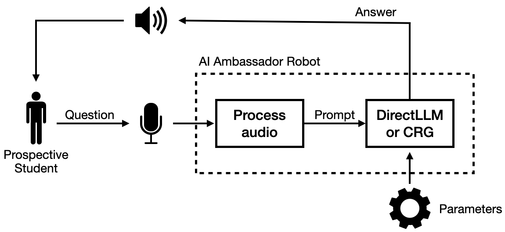
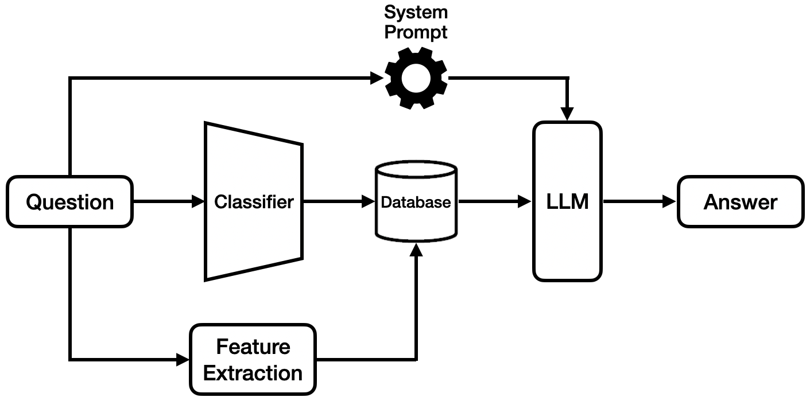

# AI Ambassador
Implementation of an AI-powered robotic tour guide system for the Lane Department
of Computer Science and Electrical Engineering (LCSEE) at West Virginia University. 
Two methodologies were explored: 
1. DirectLLM approach that fine-tunes a large language model on
a custom dataset
2. Classify-Retrieve-Generate (CRG) pipeline that modularizes classification, answer retrieval, and natural response generation. 

A custom SQuAD-style dataset was developed using LCSEE data, supporting both pipelines. The system was deployed on a Raspberry Pi 4 integrated with a Mang-Dang Mini Pupper robot. 

## Implementation
The system diagram can be seen below. A user first asks a question to the MangDang robot and an on board microphone will take the speech input and transcribe it using Uberi SpeechRecognition library interfaced with Google’s API. The question is then passed either the DirectLLM model or the CRG model to generate an answer for the user. The user will then hear the answer played back via an onboard speaker on the MangDang robot using the Flite engine by CMU.

## Dataset
A custom SQuAD-style dataset was created to support both models, consisting of 747 Q&A pairs across 10 categories:

Degree Programs,
Research Opportunities,
Facilities and Resources,
Clubs and Organizations,
Career Opportunities,
Internships,
Financial Aid and Scholarships,
Faculty Info,
Admissions,
Contact/Location.

Data augmentation was performed using ChatGPT to enhance variety and generalization.

## DirectLLM
The DirectLLM approach involves fine-tuning a small, open-source language model (e.g., FLAN-T5 or BART) directly on a custom Q&A dataset built from LCSEE department information.

**Key Features:**
- End-to-end fine-tuning on a curated SQuAD-style dataset.
- Capable of generating fluent, context-rich responses.
- Uses models with 77M–139M parameters (FLAN-T5, BART).

**Strengths:**
- High fluency and natural response generation.
- Suitable for open-ended, nuanced queries.

**Limitations:**
- Requires full retraining to incorporate new information.
- High memory usage and slower inference.
- Less maintainable in dynamic or evolving environments.

**Performance Summary:**

| Model   | Accuracy | BLEU  | Response Time (s) | Memory (MB) |
|---------|----------|-------|-------------------|-------------|
| FLAN-T5 | 68.18%   | 91.17 | 38.45             | 2115.1      |
| BART    | 27.64%   | 74.41 | 9.96              | 648.86      |

## Classify-Retrieve-Generate
The CRG approach modularizes the pipeline into three stages:  
**Classification → Retrieval → Generation**

**1. Classification**  
Predicts the category of the user's question (e.g., research, degree programs). Options include:
- Logistic Regression (TF-IDF)
- SVM (TF-IDF)
- BERT / DistilBERT (fine-tuned)

**2. Retrieval**  
Finds the best-matching answer from the dataset using:
- Keyword Matching (EKI)
- Jaccard / JEKI Score
- Semantic Embeddings + Cosine Similarity

**3. Generation**  
Refines the retrieved answer into a conversational response using lightweight models like:
- FLAN-T5-Small
- TinyLlama (1.1B)

**Strengths:**
- Modular and easy to update individual components.
- Supports fast inference and low memory usage.
- New data can be added without retraining the full model.

**Limitations:**
- Less fluent than DirectLLM for open-ended prompts.
- Response generation still in development.

**Performance Summary (Top CRG Configurations):**

| Model   | Classifier    | RS     | Response Time (s) | Memory (MB) |
|---------|---------------|--------|-------------------|-------------|
| CRG-1   | Logistic Reg. | 0.929  | 12.78             | 996.7       |
| CRG-2   | SVM           | 0.750  | 1.60              | 613.6       |
| CRG-3   | DistilBERT    | 0.929  | 14.21             | 1279.8      |

*See Table VI in paper for description of CRG-1 thorugh CRG-3*

## Comparison & Use Case

| Criteria              | DirectLLM           | CRG                    |
|-----------------------|---------------------|------------------------|
| Fluency               | ✅ Strong           | ⚠️ Developing          |
| Update Flexibility    | ❌ Requires retraining | ✅ Modular          |
| Memory Efficiency     | ❌ High usage       | ✅ Edge-friendly        |
| Response Time         | ❌ Slower           | ✅ Faster               |
| Best For              | Rich dialog         | Structured queries     |

## Project Directory & Resources 
**Folders**
- `code` - development and production code
  - `DirectLLM` - v1.0 of model. A fine-tuned LLM processes the question directly and generates an answer in one step
  - `CRG` - Classify-Retrieve-Generate, A classifier categorizes the question, retrieves relevant information from a database, and an LLM refines the response for a natural output.
  - `Interface` - User interaction between the Mini Pupper and the LLMs.
- `report` - report tex files and associated assets

**Resources** 
- Read the [full report](./report/AI_Ambassador.pdf) for in-depth description of models and trials
- See the [presentation](./report/ai_ambass_aiiot_1571135628_nonum.pdf) for a summary of the project
- [Google Drive](https://drive.google.com/drive/u/0/folders/0ACyJj38rAVkhUk9PVA) includes resources and various documentation (restricted)