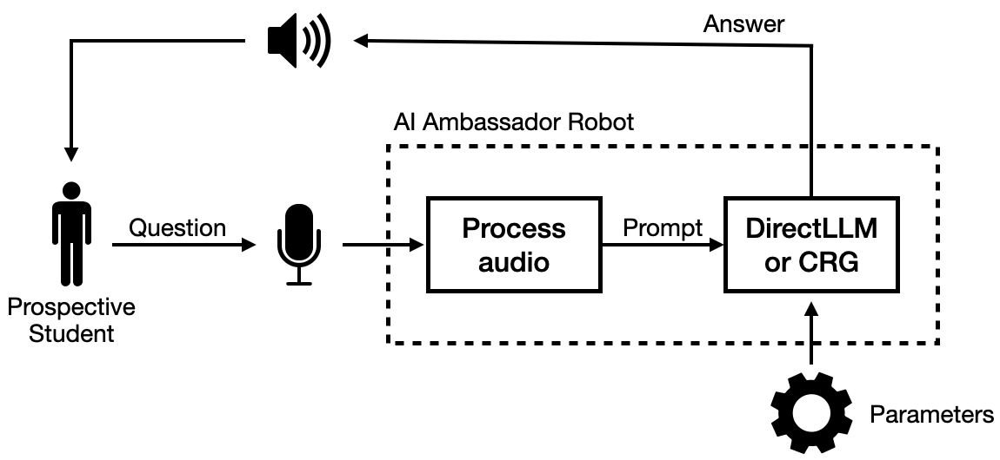
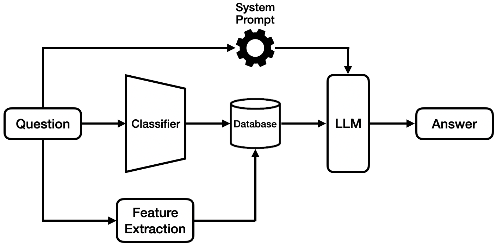

# AI Ambassador
Implementation of an AI-powered robotic tour guide system for the Lane Department
of Computer Science and Electrical Engineering (LCSEE) at West Virginia University. 
Three methodologies were explored: 
1. DirectLLM approach that fine-tunes a large language model on a custom dataset
2. Classify-Retrieve-Generate (CRG) pipeline that modularizes classification, answer retrieval, and natural response generation
3. Retrieval-Augmented Generation (RAG) approach that retrieves context from plain-text documents scraped from the department's web pages and conditions a generative model on that context

A custom SQuAD-style dataset was developed using LCSEE data, supporting all three pipelines. The system was deployed on a Raspberry Pi 4 integrated with a MangDang Mini Pupper robot. 

## Implementation
The system diagram can be seen below. A user first asks a question to the MangDang robot and an on board microphone will take the speech input and transcribe it using Uberi SpeechRecognition library interfaced with Google’s API. The question is then passed either the DirectLLM model or the CRG model to generate an answer for the user. The user will then hear the answer played back via an onboard speaker on the MangDang robot using the Flite engine by CMU.

## Dataset
A custom SQuAD-style dataset was created to support all three pipelines, consisting of 1,477 Q&A pairs across 13 categories:

Degree Programs,
Research Opportunities,
Facilities and Resources,
Clubs and Organizations,
Career Opportunities,
Internships,
Financial Aid and Scholarships,
Faculty Info,
Admissions,
Contact/Location,
Follow Up,
Repeat.

Data augmentation was performed using ChatGPT and Gemini to enhance variety and generalization.

## DirectLLM
The DirectLLM approach involves fine-tuning a small, open-source language model (e.g., FLAN-T5 or BART) directly on a custom Q&A dataset built from LCSEE department information.

**Key Features:**
- End-to-end fine-tuning on a curated SQuAD-style dataset.
- Capable of generating fluent, context-rich responses.
- Uses models with 77M–139M parameters (FLAN-T5, BART).

**Strengths:**
- High fluency and natural response generation.
- Suitable for open-ended, nuanced queries.

**Limitations:**
- Requires full retraining to incorporate new information.
- High memory usage and slower inference.
- Less maintainable in dynamic or evolving environments.

**Performance Summary:**

| Model   | Accuracy | BLEU  | Response Time (s) | Memory (MB) |
|---------|----------|-------|-------------------|-------------|
| FLAN-T5 | 68.18%   | 91.17 | 38.45             | 2115.1      |
| BART    | 27.64%   | 74.41 | 9.96              | 648.86      |

## Classify-Retrieve-Generate
The CRG approach modularizes the pipeline into three stages:  
**Classification → Retrieval → Generation**

**1. Classification**  
Predicts the category of the user's question (e.g., research, degree programs). Options include:
- Logistic Regression (TF-IDF)
- SVM (TF-IDF)
- BERT / DistilBERT (fine-tuned)

**2. Retrieval**  
Finds the best-matching answer from the dataset using:
- Keyword Matching (EKI)
- Jaccard / JEKI Score
- Semantic Embeddings + Cosine Similarity

**3. Generation**  
Refines the retrieved answer into a conversational response using lightweight models like:
- FLAN-T5-Small
- TinyLlama (1.1B)

**Strengths:**
- Modular and easy to update individual components.
- Supports fast inference and low memory usage.
- New data can be added without retraining the full model.

**Limitations:**
- Less fluent than DirectLLM for open-ended prompts.
- Response generation still in development.

**Performance Summary (Top CRG Configurations):**

| Model | Classifier    | RS     | BLEU  | Response Time (s) | Memory (MB) |
|-------|---------------|--------|-------|-------------------|-------------|
| CRG-1 | Logistic Reg. | 0.9965 | 18.96 | 0.312             | 755.52      |
| CRG-2 | SVM           | 0.9965 | 10.24 | 0.578             | 899.38      |
| CRG-3 | DistilBERT    | 0.6092 | 16.73 | 0.300             | 930.56      |

*See Table VI in paper for description of CRG-1 through CRG-3*

## Retrieval-Augmented Generation (RAG)
The RAG approach retrieves context from plain-text documents scraped from the LCSEE and Statler College websites and conditions a generative model on that context to produce a response. It requires no manually curated Q&A pairs and no model retraining — the knowledge base can be refreshed automatically by re-running a web scraper whenever the department's website is updated.

**Corpus**  
Plain-text content was scraped from eight pages covering: general department information, undergraduate programs, graduate programs, research, faculty and staff, student life, alumni and friends, and department contact information.

**Architecture**  
- **Retriever:** Documents are chunked into passages and encoded into a dense vector index using the `all-MiniLM-L6-v2` sentence embedding model. At inference time the query is embedded into the same vector space, and the top-k most similar passages are retrieved via cosine similarity.
- **Generator:** Retrieved passages are concatenated into a context block and passed to a lightweight generative model alongside the original query and a system prompt.

**Strengths:**
- Most maintainable of the three approaches, no annotation or retraining required.
- Knowledge base updates can be fully automated via a web scraper.
- Competitive BLEU score (19.72), marginally outperforming the best CRG configuration.

**Limitations:**
- Lower retrieval accuracy (44.01%) compared to CRG (99.65%), due to retrieving from unstructured prose rather than curated Q&A pairs.
- Generated responses tend to be shorter and less complete when conditioned on raw web content.

**Performance Summary:**

| Model | RS     | BLEU  | Response Time (s) | Memory (MB) |
|-------|--------|-------|-------------------|-------------|
| RAG   | 0.4401 | 19.72 | 0.383             | 775.22      |

## Comparison & Use Case

| Criteria              | DirectLLM              | CRG                    | RAG                          |
|-----------------------|------------------------|------------------------|------------------------------|
| Fluency (BLEU)        | ✅ Strong (91.17%)     | ⚠️ Moderate (18.96)    | ⚠️ Moderate (19.72)          |
| Retrieval Accuracy    | N/A                    | ✅ High (99.65%)       | ❌ Lower (44.01%)            |
| Update Flexibility    | ❌ Requires retraining | ✅ Modular             | ✅ Automated scraper updates |
| Memory Efficiency     | ❌ High usage          | ✅ Edge-friendly        | ✅ Edge-friendly              |
| Response Time         | ❌ Slower (9.96–38.45s)| ✅ Fast (0.30–0.58s)   | ✅ Fast (0.383s)              |
| Best For              | Rich dialog            | Structured queries     | Frequently updated content   |

## Project Directory & Resources 
**Folders**
- `code` - development and production code
  - `DirectLLM` - v1.0 of model. A fine-tuned LLM processes the question directly and generates an answer in one step
  - `CRG` - Classify-Retrieve-Generate. A classifier categorizes the question, retrieves relevant information from a database, and an LLM refines the response for a natural output.
  - `RAG` - Retrieval-Augmented Generation. Retrieves context from plain-text documents scraped from the department's web pages and conditions a generative model on that context.
  - `Hybrid` - Experimental hybrid pipeline combining elements of CRG, RAG and DirectLLM.
  - `Interface` - User interaction between the Mini Pupper and the LLMs.
- `report` - report tex files and associated assets

**Resources** 
- Read the [full report](./report/AI_Ambassador_Updated.pdf) for in-depth description of models and trials
- See the [presentation](./report/ai_ambass_aiiot_1571135628_nonum.pdf) for a summary of the project
- [Google Drive](https://drive.google.com/drive/u/0/folders/0ACyJj38rAVkhUk9PVA) includes resources and various documentation (restricted)